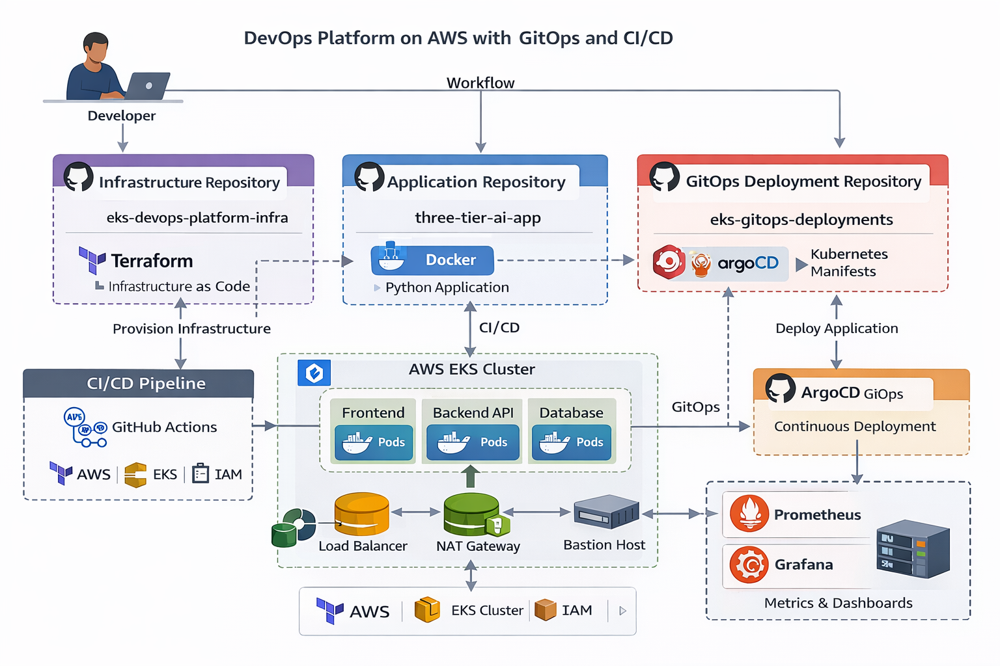

# 🚀 DevOps Platform on AWS using EKS, GitOps and CI/CD

---

## 📌 Project Overview

This project demonstrates a **production-style DevOps platform** built on AWS using modern DevOps practices.

The platform automates the deployment of a **containerized three-tier application** using the following technologies.

### Technologies Used

1. **Terraform**
   - Infrastructure as Code tool used to provision AWS infrastructure.
   - It creates resources such as VPC, subnets, NAT gateway, and EKS cluster.

2. **GitHub Actions**
   - CI/CD automation platform.
   - Used to build Docker images and push them to AWS ECR.

3. **Docker**
   - Containerization platform.
   - Packages the application and its dependencies into portable containers.

4. **Kubernetes (AWS EKS)**
   - Container orchestration system.
   - Used to deploy and manage application containers.

5. **ArgoCD**
   - GitOps continuous delivery tool for Kubernetes.
   - Automatically deploys Kubernetes manifests from a Git repository.

6. **Prometheus**
   - Monitoring system used for collecting metrics from Kubernetes.

7. **Grafana**
   - Visualization tool used to create monitoring dashboards.

---

## 🏗 Overall Architecture

The architecture follows a **GitOps-based DevOps workflow**.

Developer → GitHub → CI/CD Pipeline → Docker Image → AWS ECR → ArgoCD → Kubernetes (EKS) → Monitoring

---

## 📊 Architecture Diagram:

---

## ⚙️ Deployment Workflow

The project follows a complete DevOps deployment lifecycle.

### 1️⃣ Infrastructure Provisioning

Infrastructure is created using Terraform.

Commands used:
terraform init
terraform plan
terraform apply

This creates the following resources.

- AWS VPC
- Public and private subnets
- NAT Gateway
- AWS EKS cluster
- Bastion host
- Security groups

---

### 2️⃣ Application Containerization

Application code is packaged into Docker containers.

Example command:

**docker build -t ai-app .**

The container image is pushed to **AWS ECR**.

---

### 3️⃣ Continuous Integration

GitHub Actions automatically runs when code is pushed.

Pipeline tasks include:

1. Build Docker image
2. Push image to ECR
3. Update deployment manifests

---

### 4️⃣ GitOps Deployment

ArgoCD continuously monitors the GitOps repository.

Workflow:

1. Manifest change pushed to GitHub
2. ArgoCD detects update
3. Cluster state synchronized
4. Application deployed automatically

---

### 5️⃣ Application Running on Kubernetes

The application runs inside Kubernetes pods.

Components include:

- Frontend service
- Backend API
- Database layer

---

### 6️⃣ Monitoring and Observability

Prometheus collects metrics from the Kubernetes cluster.

Grafana displays dashboards including:

- CPU usage
- Memory usage
- Pod health
- Application performance

---

## 🧹 Cleanup (Stop AWS Costs)

To remove infrastructure and stop AWS billing:

terraform destroy

Also verify deletion of:

- EKS cluster
- NAT Gateway
- Load balancers
- ECR repositories
- EC2 instances

---

## 👩‍💻 Author

**Rasika Deshmukh**

GitHub  
https://github.com/rasika-08061998

